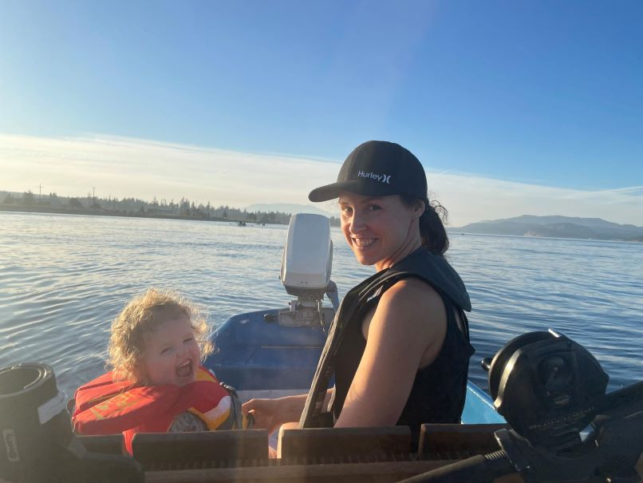
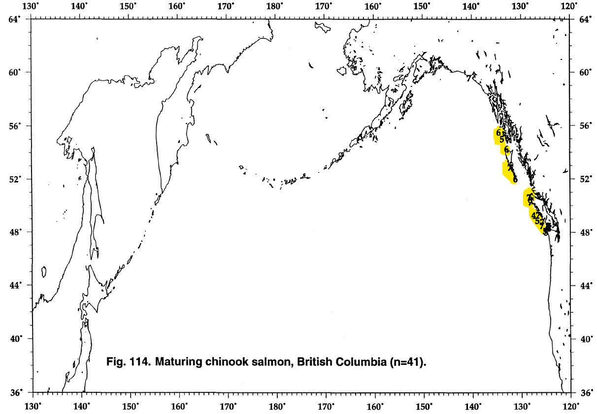

```{r link to site, include = FALSE}
"https://biggiefish.github.io/GitmeSomeTyee/"
```

## 1. What is this?
A high-level, very casual, and often self-deprecating look at trends in catches of Tyee salmon in Campbell River's legendary [Tyee Pool](https://goo.gl/maps/4Nb4etqRVjoSSfqSA). All data exploration is being completed for [fun](https://i.giphy.com/media/Cz6TlrRVVyv9S/giphy.webp) and to learn some new tools (namely [R Markdown](https://rmarkdown.rstudio.com/) and [plotly](https://plotly.com/r/)). 

There are far more technical ways of examining this data, but they aren't as much fun - and are frankly hard. This analysis is living and will evolve over time. All results and interpretation are purely speculative and should be considered nothing more than ramblings of a fish nerd. 

Normally this is where I would put pictures of all the beautiful Tyee I have captured, but that hasn't happened yet. So far, these are the best things I have managed to get in my boat  


```{r setup, include=FALSE}
knitr::opts_chunk$set(echo = TRUE)
## Prepare Working Environment ----
## Clear workspace ##
rm(list = ls())  

## This code is to fix a bug in R 2023.06.0+421 <https://github.com/rstudio/rstudio/issues/13188>
options(rstudio.help.showDataPreview = FALSE)
getOption("rstudio.help.showDataPreview")

## Load Packages and dependencies. 
list.of.packages <- c("tidyverse",
                      "tidyr",
                      "dplyr",
                      "lubridate",
                      "reshape2",
                      "ggplot2",
                      "readxl",
                      "downloadthis",
                      "knitr",
                      "captioner",
                      "zoo",
                      "gridExtra",
                      "plotly",
                      "htmlwidgets")

  ## Load any missing packags.
    new.packages <- list.of.packages[!(list.of.packages %in% installed.packages()[,"Package"])]
    if(length(new.packages)) install.packages(new.packages)

## Load Packages
    library(tidyverse)
    library(tidyr)
    library(dplyr)
    library(lubridate)
    library(reshape2)
    library(ggplot2)
    library(scales)
    library(readxl)
    library(downloadthis)
    library(knitr)
    library(captioner)
    library(zoo)
    library(gridExtra)
    library(plotly)
    library(htmlwidgets)


## Define Working Directory ---
#setwd("C:/Users/evogt/R Analysis/EAV/Tyee/")

## Define Input Files
    #1. Catch Data
    catch.dat <- "Data/TyeeCatchData.xlsx"
    
    catch.records <- "Data/TyeeCatch_RecordBook.xlsx"
    
    #2. Escapement Data
    esc.dat <- "Data/Area13Escapement.xlsx"
    
    #3. All Areas Escapement Data
    all.esc.data <- "Data/Escapement_AllAreas_Prepped.xlsx"
    
    #4. Flow Data
    q.dat <- "Data/CR_Discharge_1949-2023.xlsx" 
    
    #5. Age Class Data
    age.dat <- "Data/CR_AgeClass.xlsx"
    
    #6. Commercial Catch data
    comm.catch.data <- "Data/NPAFC_CommercialCatch_21June2022.xlsx"
    
    #7. Survival Data
    surv.data <- "Data/Welch Survival Data/Welch_2020_Review_of_Coastwide_Decline_SAR_Data.xlsx"
    
    #8. Zooplankton Biomass Data
    biomass.data <- "Data/Perry et al. 2021/pone.0245941.s002.xlsx"

## Define Output Locations
    plot.output <- "Plots/"
    model.output <- "Output/"
    
##  Set up captioner package calls. 
  fig_nums   <- captioner(prefix = "Figure")  
  table_nums <- captioner(prefix = "Table")
    
##__________________________####    
## Load Data ---- 

##* 1. Prep Blank Date Data ---- 
    date_seq <- data.frame(Date = seq(ymd('2002-07-01'), ymd('2022-09-30'), by = 'days')) %>%
                mutate(Month = strftime(Date, format = "%m"),
                       Month = as.numeric(Month)) %>%
                filter(between(Month,7,9))

## * 2. Tyee Catch Data ----
    raw_catch.data  <- read_excel(catch.dat) # Date, time and size of capture

        ## Format Catch Data Dates ##
        raw_catch <- raw_catch.data %>% mutate(Date = as.Date(RawDate),
                                          catch_binary = 1) %>%
                                   group_by(Date) %>%
                                   summarise(catch_binary = sum(catch_binary))

        ## Merge with date_sequence
        catch_daily <- left_join(date_seq, raw_catch, by = "Date") %>%
                       mutate(catch_binary = coalesce(catch_binary, 0),  
                              Year = strftime(Date, format = "%Y"),
                              Year = as.numeric(Year),
                              Month = strftime(Date, format = "%m"),
                              Month = as.numeric(Month),
                              Weeknum = strftime(Date, format = "%V"),
                              Weeknum = as.numeric(Weeknum),
                              catch_binary = coalesce(catch_binary, 0))  
      
        
        ## Calculate Yearly Catches
        catch_yearly <- catch_daily %>% 
                        group_by(Year) %>%
                        summarize(catch_yr.total = sum(catch_binary),
                                  catch_yr.mean  = mean(catch_binary)) %>%
                        ungroup %>%
                        mutate(catch_yrs.mean.total = mean(catch_yr.total),
                               catch_yrs.mean.catch = mean(catch_yr.mean),
                               tyee_cycle4 = as.numeric(rep(1:4, length.out = length(Year))),
                               tyee_cycle5 = as.numeric(rep(1:5, length.out = length(Year)))) 
                                          
        ## Calculate Weekly Catches
        catch_yrwk <- catch_daily %>% 
                      group_by(Year, Weeknum) %>%
                      summarize(catch_yrwk.total = sum(catch_binary)) 

        ## Calculate Weekly Catches
        catch_wk <- catch_daily %>% 
                    group_by(Weeknum) %>%
                    filter(between(Weeknum, 27, 39)) %>%
                    summarize(catch_wk.total = sum(catch_binary)) %>%
                    mutate(catch_wk.mean     = catch_wk.total/21) %>%         # 21 years data from 2002 to 2022
                    ungroup() %>%
                    mutate(catch_wks.mean = mean(catch_wk.mean))
        
         
        ## Merge Catch Data
        catch_dat <- left_join(catch_daily, catch_yearly, by = "Year")
        catch_dat <- left_join(catch_dat, catch_yrwk, by = c("Year", "Weeknum"))
        catch_data <- left_join(catch_dat, catch_wk, by = "Weeknum")

        colnames(catch_data)                               
 
## * 3. Escapement Data ----
        ## Load Data      
        esc_data <- read_excel(esc.dat)

        esc.dat2 <- filter(esc_data, ANALYSIS_YR > 2010)
    
        ## Prepare dataset for CR Escapement 
        cr_esc <- esc_data %>% filter(GAZETTED_NAME == "CAMPBELL RIVER",         # only show data for CR
                                  #ANALYSIS_YR >=2002) %>% # data for same time period as tyee catch data
                                      ANALYSIS_YR >=1990) %>% # data from prior to tyee catch data so we can predict tyee returns.    
                               mutate(Year          =  as.numeric(ANALYSIS_YR),
                                     Waterbody      =  as.factor(GAZETTED_NAME),
                                     esc_count      =  as.numeric(MAX_ESTIMATE),
                                     Esc_Scaled     =  as.numeric(MAX_ESTIMATE/25),
                                     Esc_Mean       =  as.numeric(mean(MAX_ESTIMATE)),
                                     Esc_MeanScaled =  as.numeric(mean(MAX_ESTIMATE/25)),
                                     Species        =  as.factor(SPECIES)) %>%
                               select(Year, Waterbody, Species, esc_count, Esc_Scaled, Esc_Mean, Esc_MeanScaled)
        
        all_esc <- read_excel(all.esc.data)
        
        ## All escapement data for Quinsam and Campbell Rivers
        colnames(all_esc)
        crQ_esc <-all_esc %>% filter(Waterbody == c("CAMPBELL RIVER","QUINSAM RIVER"),            # only show data for CR
                                 Year >=1990,
                                 Species == "Chinook") %>% # data from prior to tyee catch data so we can predict tyee returns.    
                          mutate(Year          =  as.numeric(Year),
                                 Waterbody      =  as.factor(Waterbody),
                                 esc_count      =  as.numeric(TotalReturns),
                                 Species        =  as.factor(Species)) %>%
                          group_by(Waterbody, Year) %>%
                          summarize(esc_count = sum(esc_count),
                                    Esc_Mean =  mean(esc_count))
        
      ## All escapement.
      colnames(all_esc)
      
      all.esc.prop <- all_esc %>% 
                filter(Species == "Chinook") %>%
                group_by(Year) %>%
                    mutate(yr.total.esc = sum(TotalReturns)) %>% # Total escapement per year.
                ungroup(Year) %>%
                    mutate(yr.mean.total.esc = mean(yr.total.esc)) %>%
                group_by(Year) %>%
                    mutate(yr.relative.prop = yr.total.esc/yr.mean.total.esc) %>%
                group_by(Year, Area) %>%
                    mutate(yr.Area.total.esc = sum(TotalReturns), # Total escapement in each Area by
                           yr.Area.prop.esc  = yr.Area.total.esc/yr.total.esc) %>% # Proportion of total escapement.
                    rename(Waterbody = Waterbody,
                           Year      = Year,
                           Area      = Area) %>%
                    select(Waterbody, Year, Area, TotalReturns, yr.total.esc, 
                           yr.mean.total.esc, yr.relative.prop, yr.Area.total.esc, yr.Area.prop.esc)
      
      
                           
                                           
                      
        
        
## * 4. Flow Data (Tyee Season) ----
      ## Daily flow Data from 1949 to 2021
      flow_data <- read_excel(q.dat) 
          
      flow.data.all <- flow_data %>% 
                              mutate(Season   
                                        = case_when(
                                              Month >=1 & Month <= 3 ~ "Winter",
                                              Month >=4 & Month <= 6 ~ "Spring",
                                              Month >=7 & Month <= 8 ~ "Summer",
                                              Month >=9 & Month <= 10 ~ "Fall",
                                              Month >=11 & Month <= 12 ~ "Winter")) %>%
                              group_by(Year, Season) %>%
                              mutate(q.peak.season.yr = max(Value),
                                     test.data = as.numeric(1))   

    ## Flow Data Through Tyee Season(July 1 to Sept 30. 2000 to 2022)
    flow.data.tyee <- flow.data.all %>% 
                        filter(between(Month,7,9)) %>%
                        mutate(q.daily         = as.numeric(Value),
                               Date            = as.Date(Date),
                               Year            = format(Date, '%Y'),
                               Month           = format(Date, '%m'),
                               Weeknum         = format(Date, format = "%V")) %>%
                        group_by(Year) %>% 
                              mutate(q.yr.mean  = mean(Value, na.rm = TRUE),
                                     q.yr.se = sd(Value, na.rm = TRUE)/sqrt(n())) %>% 
                        ungroup() %>%
                                           
                        group_by(Month) %>%                                              
                              mutate(q.m       = mean(Value, na.rm = TRUE),
                                     q.m.se    = sd(Value, na.rm = TRUE)/sqrt(n())) %>%
                              ungroup() %>%
                                         
                         group_by(Year, Month) %>% 
                              mutate(q.yrm     = mean(Value, na.rm = TRUE),
                                     q.yrm.se  = sd(Value, na.rm = TRUE)/sqrt(n())) %>%
                              ungroup() %>%
                   
                         group_by(Year, Weeknum) %>% 
                              mutate(q.yrwk     = mean(Value, na.rm = TRUE),
                                     q.yrwk.max = max(Value, na.rm = TRUE),
                                     q.yrwk.se  = sd(Value, na.rm = TRUE)/sqrt(n())) %>%
                              ungroup()   %>%      
 
                        group_by(Weeknum) %>%
                              mutate(q.wk       = mean(Value, na.rm = TRUE),
                                     q.wk.se    = sd(Value, na.rm = TRUE)/sqrt(n())) %>%
                              ungroup() %>%
                        mutate(q.5yr.roll.mean = rollmean(q.daily, k = 455, align = "right", fill=NA), # 5yr running flow
                               q.5y.roll.se    = rollapply(q.daily, width = 455, FUN = sd, align = "right", 
                                                           fill = NA)/sqrt(455)) %>%
                        filter(Year > 2001)

## 5. Add age data
    age_data <- read_excel(age.dat)
    
## 6. Salmon Catch Data
    comm.catch.dat <- read_excel(comm.catch.data) 

    comm.catch <- comm.catch.dat %>% 
                        pivot_longer(cols = c(7:103),
                                     names_to = "Year",
                                     values_to = "Total.Catch",
                                     values_drop_na = TRUE) %>%
                        rename(Area = "Reporting Area",
                               Prov.State = "Whole Country/Province/State") %>%
                        filter(Area == c("North Coast", "Southeast"),
                               Species == "Chinook") %>%
                        group_by(Area, Prov.State, Year) %>%
                        mutate(Overall.Total.Catch = sum(Total.Catch))
    colnames(comm.catch.dat)
    
    
## 7. Survival Data
    surv.data <- read_excel(surv.data) 

```


###    1.1 The data

I have compiled the following datasets to use in this analysis. Whether they are all incorporated is yet to be seen.

1) Annual catch records from the [Tyee Club](https://www.tyeeclub.org/catch-records/>). 
2) Discharge data collected on the Campbell River by the [Water Survey of Canada](https://wateroffice.ec.gc.ca/index_e.html).
3) Annual Chinook Salmon escapement data available in the [DFO NuSEDS database](https://open.canada.ca/data/en/dataset/c48669a3-045b-400d-b730-48aafe8c5ee6).
4) Annual catch statistics from the [North Pacific Anadromous Fish Commission](https://npafc.org/statistics/).
5) Area based commercial catch statistics from DFO are [available from 2001 to 2016](https://www.pac.dfo-mpo.gc.ca/stats/smon/index-eng.html) 
6) Straight of Georgia herring [spawn](https://www.pac.dfo-mpo.gc.ca/science/species-especes/pelagic-pelagique/herring-hareng/herspawn/tabsfram-eng.html) and [catch](https://www.pac.dfo-mpo.gc.ca/science/species-especes/pelagic-pelagique/herring-hareng/herspawn/tabcfram-eng.html) data. 
7) Southeast Alaska commercial catch data from [North Pacific Anadromous Fish Commission](https://npafc.org/statistics/).
8) Hatchery release statistics from [North Pacific Anadromous Fish Commission](https://npafc.org/statistics/).
9) [Known ocean ranges of Pacific Salmon and Steelhead stocks](https://npafc.org/wp-content/uploads/2017/08/192USA.pdf) 
10) [Chinook survival data prepared by Welch et al. 2020](https://datadryad.org/stash/dataset/doi:10.5061/dryad.w6m905qmm)  


This is certainly an interesting dataset, especially given it is the centenary of the Tyee Club,  but it has its limitations. For example, there is no accessible information on effort (# boats per day), biological data (e.g. size, girth and age of tyees) or numbers of non-tyee salmon captured in the pool. 

## 2. Let's look at the Tyee catch data!
There are lots of ways to look at this data. I am most curious about three things:

1) How total catches vary among years and if they fluctuate relative to escapement.

2) When are Tyees most frequently captured?

3) Has fish size changed across seasons? Does fish size vary within seasons? 


### 2.1 How catches vary among years.
```{r plot1_prep_tyeecatch, include=FALSE}
## Prepare Plot
catch.data.yearly <- catch_data %>% 
                          group_by(Year, tyee_cycle4) %>%
                          summarize(Total.Catch = mean(catch_yr.total),
                                    Overall.Mean.Catch = mean(catch_yrs.mean.total)) %>%
                          mutate(Year = as.factor(Year))
                                      
plot1 <- ggplot(catch.data.yearly) +
                      geom_col(aes(x= Year, y = Total.Catch, fill = tyee_cycle4)) + 
                      geom_hline(aes(yintercept=Overall.Mean.Catch, color = Overall.Mean.Catch), 
                                linetype = "dashed", linewidth = 0.5) +
                      labs(y = "# Tyee Salmon", x = "") +
                      guides(fill = "none", #guide_legend(title = "Tyee Cycle"),
                             color = guide_legend(title = "Mean catches per year", label = FALSE)) +
                      # scale_x_discrete(breaks = seq(2002,2023,2)) +
                      # scale_y_discrete(breaks = seq(0, 100, 5)) +
                      theme_bw() +
                      theme(legend.position = c(0.78, 0.88),
                            legend.box.background = element_rect(colour = "black", linewidth = 1.25, fill = NA))

#ggplotly(plot1, tooltip = c("Year", "Total.Catch"))

```


```{r plot1_tyeecatch, include = FALSE, fig.width=8, fig.height=5}

#suppressWarnings(ggplotly(plot1, tooltip = c("Year", "Total.Catch")))

# **`r fig_nums("plot1", "Number of Tyee Salmon captured per year since 2002.")`**

#suppressWarnings(print(plot1)) 
```


```{r plot2_prep_tyee.v.escapement, include=FALSE}
## Filter escapement data.... 
cr_esc2 <- cr_esc %>% filter(Year >=2002)

## Merge escapement data with tyee catch data
cr_data <- left_join(catch_data, cr_esc2, by = "Year")
    
cr_yearly <- cr_data %>% filter(Year <= 2022) %>%
                         group_by(Year, tyee_cycle4) %>%
                         summarize(Total.Catch        = mean(catch_yr.total),
                                   Overall.Mean.Catch = mean(catch_yrs.mean.total),
                                   Escapement         = mean(Esc_Scaled)) %>%
                         mutate(Year = as.numeric(Year),
                                Data.Type = "Escapement") 

plot2 <- ggplot(cr_data) +
                geom_bar(aes(x = Year, y = catch_binary, fill = tyee_cycle4),
                              stat = "identity") +
                geom_line(aes(x = Year, y = Esc_Scaled, linetype = Species),
                              color = "lightblue", linewidth = 1.2) +
                geom_hline(aes(yintercept = catch_yrs.mean.total, color = catch_yrs.mean.total),
                              linetype = "dashed", linewidth = 0.5) +
                labs(x = "Year", y = "Number Tyee Captured") +
                guides(fill =  "none",
                       linetype = guide_legend(title = "Escapement", label = FALSE),
                       color = guide_legend(title = "Mean Tyee Catch", label = FALSE)) +
                scale_y_continuous(breaks = seq(0, 100, 5),
                                    sec.axis = sec_axis(~.*25, name = "Escapement")) +  #scale secondary access by x25
                scale_x_continuous(breaks = seq(2002,2022,2)) +
                theme_bw() +
                theme(legend.direction = "horizontal",
                      legend.position = "bottom")

## Figure for plotly
## Secondary Y axis does not work well in plotly.
# plot2.1<- ggplot(cr_yearly, aes(x = Year)) +
#                       geom_col(aes(y = Total.Catch, fill = tyee_cycle4)) +
#                       geom_line(aes(y = Escapement, linetype = Data.Type), 
#                                 color = "lightblue", linewidth = 1.2) +
#                       geom_hline(aes(yintercept = Overall.Mean.Catch, color = Overall.Mean.Catch), 
#                                 linetype = "dashed", linewidth = 0.5) +
#                       labs(y = "# Tyee Salmon", x = "") +
#                       guides(linetype = "none",
#                              fill = "none",
#                              color = guide_legend(title = "Mean catches per year", label = FALSE)) +
#                       scale_x_discrete(breaks = seq(2002,2023,2)) +
#                       scale_y_discrete(breaks = seq(0, 100, 5)) +
#                       theme_bw() +
#                       theme(legend.position = c(0.78, 0.88),
#                             legend.box.background = element_rect(colour = "black", linewidth = 1.25, fill = NA))

```

```{r plot2_tyee.v.escapement, echo=FALSE}

## ggplot figure
suppressWarnings(print(plot2))

## plotly figure
    #suppressWarnings(ggplotly(plot2.1, tooltip = c("Year","Total.Catch", "Escapement", "Overall.Mean.Catch")))   
```

**`r fig_nums("plot2", "Trends in Tyee Salmon captures and Campbell River Chinook Salmon escapement.")`**

A quick look at Tyee catches (blue vertical bars) in `r fig_nums("plot2", display = "cite")` shows:

1) There is a fairly clear 4-year cycle of relatively higher catches (highlighted with shading). Which is interesting, and raises lots of questions...
2) There has been a consistent decline in the number of Tyee salmon captured per year.
3) There was a major crash or failure in 2014. 

If we look at Escapement data (blue line) shown in `r fig_nums("plot2", display = "cite")` , we can see:

1) There has been a general declining trend in escapement (consistent with regional trends),
2) Periods of increased escapement correspond with periods of increased Tyee catches, but not always (e.g. 2005, 2017 and 2020). Given the lack of information on effort (e.g. # of boats fishing per day) we cannot tease apart whether the lack of catches in some years is due to reduction in pressure. 
3) It is also possible that years with high escapement and low Tyee numbers were due to an increased proportion of smaller fish returning to the Campbell. Without annual information on age structure I cannot tease this apart.

Now, lets see when fish are most frequently captured throughout the season, and if there has been a change over time.

### 2.2 When fish are most frequently captured.

The Tyee season runs from July 15 to September 15. I need to pick my battles with my wife and boss. Let's see which days I should be fighting for!? 

#### 2.2.1 First Tyee of the Year
```{r, first.catch.prep, include = FALSE}
colnames(catch_data)

first.catch <- catch_data %>% mutate(date.std = case_when(year(Date) >= 0 ~ 'year<-'(Date, 2021))) %>%    #Set all dates to same year)
                              filter(catch_binary > 0) %>%
                              group_by(Year) %>%
                              mutate(first.fish     = min(Date)) %>%
                              ungroup() %>%
                              group_by(Year, first.fish) %>%
                              mutate(total.catch = if_else(first.fish == Date, catch_binary,0),
                                     binary.catch = 1) %>%
                              filter(total.catch != 0)
colnames(first.catch)


first.catch.plot <- ggplot(first.catch) +
                          geom_bar(aes(x = date.std, y = total.catch, fill = Year), stat = "identity") +
                          scale_x_date(date_minor_breaks = "1 day", 
                                       date_breaks = '1 week', 
                                       date_labels = '%b-%d', 
                                       limits = c(as.Date("2021-07-25"), as.Date("2021-08-15"))) +
                          labs(x = "Date of First Capture", y = "Frequency") +
                          theme_bw()
    

```

Let's see when the first Tyee are most frequently captured each season. Alright, looks like I should have fished tonight (August 1) and need to fish August 6. Note that values for August 2 and August 7 are somewhat misleading as the plot is showing the number of fish captured on opening day. 


```{r first.catch.plot, echo=FALSE}

## plotly figure
    suppressWarnings(ggplotly(first.catch.plot))   
```

**`r fig_nums("first.catch.plot", "Number of Tyee captured on date when first Tyee is registered.")`**

 
 

#### 2.2.2 When the most Tyee's are captured each year.

```{r daily.decadal.tyee.prep, include = FALSE}
colnames(catch_data)
str(catch_data)

daily.decadal.catch <- catch_data %>% 
                            mutate(decade   = format(floor_date(Date, years(10)), '%Y'),             ## calculate decade
                                   date.std = case_when(year(Date) >= 0 ~ 'year<-'(Date, 2021))) %>%  #Set all dates to same year
                            group_by(decade, date.std) %>%
                            summarize(catch = sum(catch_binary))

colnames(daily.decadal.catch)
str(daily.decadal.catch)

group.colors <- c(2000 == "lightblue", 2010 == "dodgerblue", 2020 =="blue1")
                          

daily.decadal.catch.plot <- ggplot(daily.decadal.catch) +
                                geom_col(aes(x= date.std, y = catch, fill = decade)) +
                                labs(x = "", y = "# Tyees Captured") +
                                scale_x_date(date_minor_breaks = "1 day", date_breaks = '1 week', 
                                             date_labels = '%b-%d', 
                                             limits = c(as.Date("2021-07-01"), as.Date("2021-09-15"))) +
                                scale_fill_manual(values = c("lightblue", "dodgerblue", "blue1")) +
                                guides(fill = guide_legend(title = "Decade")) +
                                theme_bw() +
                                theme(axis.text.x = element_text(angle = 45, vjust = 1.1, hjust = 1)) 

```


```{r daily.decadal.tyee.plot, echo=FALSE}

## plotly figure
    suppressWarnings(ggplotly(daily.decadal.catch.plot, tooltip = c("decade", "date.std","catch")))   
```

**`r fig_nums("daily.decadal.catch", "Total fish captured by date and decade")`**

This plot will become a lot more interesting once I can get my hands on some historical data. But for now, we can see:

  +   People either do not fish, or do not catch fish before late July/early August. Given the way catches increase through August I am thinking it is the latter.
  +   Peak catches occur in mid to late August. 
  +   August 18-19 is a must fish kind of day.
  +   Good luck on July 30.
  
OK, well now we know not to bother fishing until early August, that I should book the off the last 3 weeks of August and that odds are that 2023 is not going to set a new record for most Tyee's captured. But who knows. 

### 2.3 Does fish size vary within or between seasons?
```{r fish.size.prep, include = FALSE}
colnames(raw_catch.data)

str(raw_catch.data)
fish.size <- raw_catch.data %>% mutate(weight = as.numeric(Weight2),
                                       Date   = as.Date(RawDate),
                                       decade   = format(floor_date(Date, years(10)), '%Y'),  ) %>%
                                group_by(Year) %>%
                                summarize(wt.yr.mean = mean(Weight2),
                                          wt.yr.n    = n(),
                                          wt.yr.sd   = sd(Weight2),
                                          wt.yr.se   = sd(Weight2)/sqrt(n())) %>%
                                mutate(Tyee.Cycle4 = as.numeric(rep(1:4, length.out = length(Year))),
                                       wt.yr.mean  = as.numeric(wt.yr.mean, digits = 2),
                                       wt.yr.se    = as.numeric(wt.yr.se, digits = 2)) %>%
                                ungroup() %>%
                                mutate(mean.wt.overall = mean(wt.yr.mean))


summary(fish.size$wt.yr.mean)
library(scales)
wt.plot <- ggplot(fish.size, aes(x = Year)) +
                geom_col(aes(x= Year, y = wt.yr.mean, fill = Tyee.Cycle4)) +
                geom_errorbar(aes(ymin = wt.yr.mean - wt.yr.se, ymax = wt.yr.mean + wt.yr.se), width = 0.2) +
                geom_hline(aes(yintercept = mean.wt.overall, color = 'Overall Mean'), linetype = 'twodash', color = 'red', linewidth = 1) +
                labs(x = "", y = "Mean Weight (lb)") +
                scale_y_continuous(limits = c(30,40), oob = rescale_none, breaks = seq(30, 40, 2)) +
                scale_x_continuous(breaks = seq(2002, 2022, 2)) +
                theme_bw() +
                guides(fill = "none",
                       color = guide_legend(title = "Overall Mean Weight")) 


wt.plot
```


```{r wt.plots, echo=FALSE}
## ggplot figure
suppressWarnings(ggplotly(wt.plot))

 
```

**`r fig_nums("wt.plot", "Mean annual weight of Tyee Salmon captured since 2002.")`**

So overall mean fish size is relatively consistent across years. That's good news, but maybe there are better ways to look at this data. Bar plots can be deceptive.

```{r wt boxplot, include=FALSE}

wt.box2 <- ggplot(raw_catch.data) +
              geom_boxplot(aes(x = Year, y = Weight2, group = Year, fill = Cycle), outlier.shape = NA) +
              geom_jitter(aes(x = Year, y = Weight2), width=0.1,alpha=0.2) + 
              labs(y = "Weight (lb)", x = "") +
              scale_x_continuous(breaks = seq(2002, 2022, 2)) +
              scale_y_continuous(breaks = seq(30, 65, 5)) +
              guides(fill = "none")  +
          theme_bw()


```


```{r wt.boxplots, echo=FALSE}

## ggplot figure
suppressWarnings(ggplotly(wt.box2))
```

**`r fig_nums("wt.plot", "Mean annual weight of Tyee Salmon captured since 2002.")`**

Well that is a bit better. The overall mean size of Tyee has stayed relatively stable across years, which makes sense given there is a minimum size limit for Tyee - but there also appears to fewer bigger fish being captured each year.  


```{r fish size by date, include = FALSE}
colnames(raw_catch.data)
str(raw_catch.data)
min(raw_catch.data$DateStandard)
max(raw_catch.data$DateStandard)
raw_catch.data <- raw_catch.data %>% mutate(DateStandard = as.Date(DateStandard))

wt.scatter <- ggplot(raw_catch.data) +
              geom_point(aes(x= DateStandard, y=Weight2, color = Year)) +
              scale_x_date(date_breaks = "5 days", date_labels = "%m-%d", minor_breaks = "1 day") +
              labs(x = "", y = "Weight (lb)") +
              theme_bw() +
              guides(color = guide_colourbar(barwidth = 15, barheight= 0.5, direction = "horizontal")) +
              theme(legend.position = c(0.7, 0.9),
                    legend.background = element_rect(fill = "lightgrey", color="black", size = 0.5))  

```
```{r wt.scatter.plot, echo = FALSE}
suppressWarnings(ggplotly(wt.scatter))
```
**`r fig_nums("wt.scatter", "Weight of Tyee salmon caught per day since 2002.")`**

What a mess. Pretty hard to identify any relationships from that figure. 

### 2.4 Daily catches per year.
To round this out, let's just have a look at the total number of fish caught per day over the past 20 years. 

```{r, all.catches.preps, echo = FALSE}
catch_data <- catch_data %>% mutate(Year = format(Date, '%Y'),
                                        Month = format(Date, '%m'),
                                        Weeknum = format(Date, '%V'))    

    flow.catch <- left_join(flow.data.tyee, catch_data, by = c("Year","Month","Weeknum","Date"))

    
    ## Reduce to past 5 years only.                          
    flow.catch <- flow.catch %>%  
                  mutate(catch_scaled    = catch_binary * 7, 
                         q.daily.scaled  = q.daily/20,
                         q.5yr.rm.scaled = q.5yr.roll.mean/20,
                         q.5y.rse.scaled = q.5y.roll.se/20,
                         date.std = case_when(year(Date) >= 0 ~ 'year<-'(Date, 2021),TRUE ~ Date)) ## Set all dates to same year
                                                
    
    flow.catch.2022 <- flow.catch %>% filter(between(date.std, as.Date("2021-07-15"), as.Date("2021-09-15")),
                                               Year  >= 2019,
                                               PARAM == 1)
    
    flow.catch.recent <- flow.catch %>% filter(between(date.std, as.Date("2021-07-15"), as.Date("2021-09-15")),
                                               Year >2006,
                                               PARAM == 1)
    
# Plot of # Tyee per day, relative to flow. From 2016 to 2022.
plot3 <-    ggplot(flow.catch.2022) +
                 geom_bar(aes(x = date.std, y = catch_scaled, fill = PARAM), stat= "identity", color = "Navy") +
                 #geom_line(aes(x = date.std, y = q.daily, linetype = "dashed", color = "Daily")) +
                 #geom_line(aes(x = date.std, y = q.5yr.roll.mean, linetype = "twodashed", color = "5-yr Mean")) +
                 geom_text(aes(x = as.Date("2021-07-20"), y = 10, label = str_c("Total Catch = ",catch_yr.total), size = 8))+
                 labs(x = "Date", y = "Discharge") +
                 scale_x_date(date_breaks = "5 days", date_labels = "%m-%d", minor_breaks = "1 day") +
                 scale_y_continuous(breaks = seq(0, 75, 13),
                                    sec.axis = sec_axis(~./7, name = "Number of Fish")) +  #scale secondary access by x25
                 guides(fill = guide_legend(title = "# Tyee", label = FALSE),
                        linetype = "none",
                        color = guide_legend(title = "Discharge (cms)", label = TRUE),
                        size = "none") +
                 facet_grid(Year~.) +
                 theme_bw() +
                 theme(legend.position = "bottom") 

#str(flow.catch.recent)
# Plot of # Tyee per day relative to flow, from 2002 to 2022.
plot4 <-    ggplot(flow.catch.recent) +
                 geom_bar(aes(x = date.std, y = catch_scaled, fill = PARAM), stat= "identity", color = "Navy") +
                 geom_line(aes(x = date.std, y = q.daily, linetype = "dashed", color = "Daily")) +
                 geom_line(aes(x = date.std, y = q.5yr.roll.mean, linetype = "twodashed", color = "5-yr Mean Discharge")) +
                 geom_text(aes(x = as.Date("2021-07-20"), y = 13, label = str_c("Total Catch = ",catch_yr.total), size = 8)) +
                 labs(x = "", y = "Discharge (cms)") +
                 scale_x_date(date_breaks = "5 days", date_labels = "%m-%d", minor_breaks = "1 day") +
                 scale_y_continuous(breaks = seq(0, 130, 10),
                                    sec.axis = sec_axis(~./7, name = "Number of Fish")) +  #scale secondary access by x25
                 guides(fill = "none",
                        linetype = "none",
                        color = guide_legend(title = "Discharge (cms)", label = TRUE),
                        size = "none") +
                 facet_grid(fct_rev(Year)~.) +
                 theme_bw() +
                 theme(legend.position = "bottom")  

```

```{r, allcatches, echo=FALSE, fig.width = 10, fig.height = 35}

suppressWarnings(print(plot4))

```

**`r fig_nums("daily.decadal.catch", "Total fish captured by date and decade")`**


Without additional data there is not much else to look at. So let's change gears and start poking around at what may be contributing to observed patterns in catches and size.

## 3. What do we know about CR Chinook?

(* more like what have others learned about Chinook in the Campbell, I don't know much).

There has been a lot of information collected on Campbell River Chinook Salmon, including from Tyee Salmon captured in the Tyee Pool, however, most of this data is not readily available online. Data that is available (and that I have found) is summarized below. Data and study results from other systems have also been included for comparison and emphasis. 

### 3.1. Quinsam vs. Campbell

  +   The vast majority of Chinook Salmon returning to the Campbell River system are from the Quinsam River. Based on available escapement data for both systems, a mean of 12.5% Chinook returning to the system are from the Campbell River (varies from 6% to 25% between 1991 and 2019).
  
     
```{r, CampbellEscapement.prep, include = FALSE}
crQ_esc <- crQ_esc %>% rename(Escapement = esc_count)

crq_esc.plot <- ggplot(crQ_esc) +
                    geom_col(aes(x=Year, y = Escapement, fill = Waterbody)) + 
                    labs(x = "", y = "Escapement") + 
                    scale_y_continuous(label = comma, breaks = seq(0,15000,2500)) + 
                    scale_x_continuous(breaks = seq(1990, 2022, 2)) +
                    theme_bw() + 
                    theme(legend.position = "bottom")

```

```{r plot_crQ_escapement, echo = FALSE, fig.width=8, fig.height=5}

suppressWarnings(ggplotly(crq_esc.plot))
```

**`r fig_nums("crq_esc.plot", "Chinook Salmon escpaement in the Campbell and Quinsam rivers from 1991 to 2021.")`**

### 3.2 Tyee Club Data (presented by Campbell River Salmon Foundation)

  +   The origin of fish captured in the tyee pool was determined by examining coded wire tags in adipose clipped fish and otoliths in non-clipped fish captured between 2015-2018 [CRSF 2018](https://www.tyeeclub.org/wp-content/uploads/2021/10/CRSF-Infographic-Poster-Tyee-Club-Heads.pdf). This data suggests the majority of captured fish in the pool (including undersize) are from the Quinsam Hatchery (mean = 61% across all years), followed by the Discovery Passage Seapens (mean = 17% across all years). The remaining 6% of fish are intercepted on route to natal streams (e.g. Big Qualicum, Nitinat, Washington State hatcheries).
  
  +   Despite 79% of all captured fish having an adipose fin, only 16% were actually wild and not of hatchery origin. Meaning most hatchery fish were not visually marked (but did have thermal otolith marking), which is not surprising given resources required for fin clipping.  
  
  +   Ages calculated from a subset of otoliths of fish captured in the tyee pool between 2015-2018 (n = 48) shows that the majority of fish are Age-4 (overall mean = 75%), followed by Age-5 (17%) and Age-3 (8%). No Age-6 fish were identified in the sub-sample of heads that were aged.
  
  +   Of the 350 fish captured in the Tyee pool between 2015 and 2018, 26% were Tyee salmon (n = 90). However, this varied between years with Tyee representing 18% to 32% of all fish captured between years. 
  
  
### 3.2 Spawn Timing

  +   Chinook spawning occurs from late September through early November and peaks in mid-October. Spawners typically reside in the river for ~12 days. 

### 3.3 Age Class Structure

  +   A roughly equal proportion of spawners return to the Campbell River as age-4 and age-5 fish (see Table 1) [Sturham et al. 1999](https://publications.gc.ca/collections/collection_2014/mpo-dfo/Fs97-4-2477-eng.pdf). Very few fish return as Age-6 (`r format((1/99)*100, digits = 2)`% (1 of 99 fish) of Campbell River fish in Sturham dataset.

  +   However, [Ewart & Anderson,2013](http://www.crsalmonfoundation.ca/wp-content/uploads/2021/01/CRSF12BYchinreportfinal.pdf) report that Age-5 fish were dominant in 2012 (61%), with Age-4's accounting for only 37% of the run, and age-3's representing only 2%. Age-6 fish were absent from the 2013 dataset. 
  

  
```{r}
catch_data %>% filter(Year >=2015, Year <=2018) %>% 
               group_by(Year) %>%
               summarize(total.catch = sum(catch_binary))          
```


### 3.4 Size-at-Age

  +   I have not found any measures of individual fish. But binned data from [Sturham et al. 1999](https://publications.gc.ca/collections/collection_2014/mpo-dfo/Fs97-4-2477-eng.pdf) (see Table 1) shows that Age-3 fish were between 500 mm and 699 mm (mean = 595 mm), Age-4 fish generally range in size from 550-949 mm (mean ~ 780 mm) and age-5 fish range from 700-949 mm (mean ~ 840 mm). Age-6 fish were identified, but accounted for less than 1% of all fish in the Campbell (n = 1 fish, 930 mm). 
  +  Fish in the Quinsam River are comparable in size to those in the Campbell, though hatchery fish generally return at a smaller size than their wild counterparts in the Campbell and Quinsam. Sturham et al. (1999) data suggest Age-4 and Age-5 wild fish may exceed 900 mm, while only Age-5 hatchery fish are likely to exceed 900 mm. 
  
   
```{r table1prep, include = FALSE}
## Prepare data for table
age_table1 <- age_data %>% select(Waterbody, Age, n, bin_min, bin_max, meanFL, SD, SE) %>%
                           #filter(Waterbody == "Campbell River") %>%
                           mutate(Age = as.factor(Age),
                                  meanFL = as.numeric(meanFL),
                                  bin_min = as.numeric(bin_min),
                                  bin_max = as.numeric(bin_max))

  age_table1 <- age_table1 %>% dplyr::group_by(Waterbody, Age) %>%
                                summarize(n = sum(n),
                                          bin_min = min(bin_min),
                                          bin_max = max(bin_max),
                                          mean = mean(meanFL)) %>%
                                mutate('% of Total' = prop.table(n)*100,
                                       size_range = paste(bin_min, "-", bin_max)) %>%
                                select(Waterbody, Age, n, '% of Total',size_range, mean, )

```

 
```{r table1, echo = FALSE}
knitr::kable(age_table1, col.names = c("Waterbody", "Age", "n", "% of Total", "Size Range <br>(mm)", "Mean Lenght <br>(mm)"),
             digits = 1,  align=rep('c', 5),
             caption = "Table 1. Size at age of Chinook Salmon captured in Campbell River watershed from [Sturham et al. 1999](https://publications.gc.ca/collections/collection_2014/mpo-dfo/Fs97-4-2477-eng.pdf)")
```

  
Interesting side notes on recent studies examining trends in size of Chinook salmon.

  +   [Lewis et al. 2015](https://journals.plos.org/plosone/article?id=10.1371/journal.pone.0130184) report that the size and age of Chinook returning to Alaska over the past 30-years has been decreasing and speculate that size-selective fisheries may be driving earlier maturation and declines in size (*emphasis on speculate*, they also point out that marine conditions and competition could produce similar results).
  +   [Ohlberger et al. 2018](https://onlinelibrary.wiley.com/doi/full/10.1111/faf.12272) built on this work and showed that there has been a reduction in the proportion of older Chinook age classes throughout most regions of the East Pacific and that length-at-age of older fish has decreased while length-at-age of smaller fish has increased.
  +   [Oke et al. 2020](https://www.nature.com/articles/s41467-020-17726-z) state that relative to salmon maturing before 1990, adult Chinook salmon now produce 16% fewer eggs, transport 28% less nutrients and have lost 21% of their fisheries value. 
  +   [Malick et al. 2023](https://onlinelibrary.wiley.com/doi/abs/10.1111/faf.12738) reviewed 25 years of  broodstock data from 43 hatcheries and found evidence of a significant reduction in length (and fecundity).

   
### 3.5 Fecundity

  +   According to [Ewart & Anderson (2013)](http://www.crsalmonfoundation.ca/wp-content/uploads/2021/01/CRSF12BYchinreportfinal.pdf), female Chinook returning to the Campbell River in 2012 carried roughly ~5,700, a decrease from the roughly 6,000 eggs typically carried.  
  
  +   Decreasing fecundity rates have also been reported in larger studies. For example, [Malick et al. 2023](https://onlinelibrary.wiley.com/doi/abs/10.1111/faf.12738) compiled 2.5 decades worth of broodstock data from 43 hatcheries to examine trends in fecundity. They found significant declines in fecundity (and length), with the greatest drop in fecundity occurring over the past decade. This reduction in fecundity was primarily explained by a reduction in the size of spawners. Not particularly relevant, but they also estimate that a 1 mm reduction in length results in ~7.8 few eggs per female

### 3.6 Juvenile Life History

  +   Juvenile Chinook Salmon in the Campbell River have been studied intensively since 2015 (e.g. [Thornton et al. 2022](https://www.bchydro.com/content/dam/BCHydro/customer-portal/documents/corporate/environment-sustainability/water-use-planning/vancouver-island/jhtmon-15-Yr-7-2022-07-25.pdf). These data suggest fry emerge in February-March and that nearly all Campbell River Chinook out migrate as Age-0+ juveniles from March through July. Smaller recently emerged Age-0+ fry are dominant and typically captured from March through early May (37 to 52 m). The remaining fish emigrate as slightly larger Age-0+ smolts (~64 to 88 mm) from May through July.
    
### 3.7 Estimated Juvenile Production

  +   Estimates of juvenile Chinook production based on numbers of observed spawners have generally been less than numbers trapped  throughout the out-migration period ([Thornton et al. 2022](https://www.bchydro.com/content/dam/BCHydro/customer-portal/documents/corporate/environment-sustainability/water-use-planning/vancouver-island/jhtmon-15-Yr-7-2022-07-25.pdf)), suggesting juvenile survival rates may be above average (e.g. >10%). 
  
  +   Juvenile survival was very low in both 2014 and 2016, which may be due to unusually high flows during spawning and/or incubation periods in each year. 

### 3.8 Estimates of Marine Survival

  +   Marine survival of unfed fry released from the Quinsam hatchery range from 0.2% to 0.4% (yes, that is less than 1%) ([Ewart & Anderson 2013](http://www.crsalmonfoundation.ca/wp-content/uploads/2021/01/CRSF12BYchinreportfinal.pdf)). 
  
  
```{r survival.plot.prep, include = FALSE}
surv.datas <- surv.data %>% filter(Region == "SOG", 
                                   Stock !="Quinsam",
                                   SmoltAge == 0)

surv.quinsam <- surv.data %>% filter(Stock == "Quinsam")
colnames(surv.datas)

  breaks = 10**(1:10)
  scale_y_log10(breaks = breaks, labels = comma(breaks))
  
 surv.plot <- ggplot(surv.datas) +
                    geom_point(aes(x = SmoltYear, y = SAR, colour = Stock)) +
                    geom_smooth(aes(x = SmoltYear, y = SAR), se = TRUE) +
                    geom_point(data = surv.quinsam, aes(x = SmoltYear, y = SAR, fill = "Quinsam"), 
                                colour = "black", pch = 21, size = 2) +
                    scale_y_continuous(trans = "log10", breaks = scales::log_breaks(n = 10)) + 
                    labs(x = "", y = "Smolt-Adult Returns (%)") +
                    guides(colour = guide_legend(title = "Other Stocks", labels = TRUE, order = 2),
                           fill = guide_legend(title = "", labels = TRUE, order = 1)) +
                    theme_bw()
 
 ## Fix weird formatting in plotly legend showing ",1" after label name.
surv.plotly <- ggplotly(surv.plot) 
 
 for (i in 1:length(surv.plotly$x$data)){
    if (!is.null(surv.plotly$x$data[[i]]$name)){
        surv.plotly$x$data[[i]]$name =  gsub("\\(","",str_split(surv.plotly$x$data[[i]]$name,",")[[1]][1])
    }
}
colnames(surv.quinsam)
surv.quinsam %>% filter(SmoltYear >= 2000) %>%
                 summarize(mean = mean(SAR),
                           min  = min(SAR),
                           max  = max(SAR))
              

```

  +   However, based on data from [Welch et al. 2020](https://onlinelibrary.wiley.com/doi/epdf/10.1111/faf.12514), survival of coded wire tagged chinook in the Quinsam ranged from a low of `r format(min(surv.quinsam$SAR), digits = 2)`% in 2007 to a high of `r format(max(surv.quinsam$SAR), digits = 2)`% in 1977, with an overall mean of `r format(mean(surv.quinsam$SAR), digits = 2)`%. Mean survival since 2000 is lower (0.28%, 0.56% to 0.56%). These estimates are generally within the range of other hatchery released sub-yearling populations within the straight of Georgia (see image below using data from Welch et al. 2020).  
  

```{r surv.plot, echo = FALSE, fig.width=8, fig.height=5}

suppressWarnings(ggplotly(surv.plotly))

```

**`r fig_nums("surv.plot", "Survival of coded wire tagged Chinook sub-yearlings (Age-0 upon release) released from hatcheries throughout the Strait of Georgia, including the Quinsam River. Note that y-axis is log transformed to better see range of values (labels are actual values). Figure prepared using data prepared by [Welch et al. 2020](https://onlinelibrary.wiley.com/doi/epdf/10.1111/faf.12514) ")`**

  +   [Welch et al. 2018](https://onlinelibrary.wiley.com/doi/epdf/10.1111/faf.12514) used coded-wire tag data to look at large scale patterns of Chinook salmon survival. This data demonstrates that survival collapsed over the past half century by a factor of ~3 and is currently ~1% in many regions (consistent with estimates available for the Campbell). Survival in relatively pristine and undeveloped regions (e.g. Northern BC and Alaska) was comparable to areas with extensive water management and land development that were previously considered to have poorest survival (e.g. Columbia River). The authors suggest the widespread trends in survival may be evidence that marine conditions are more influential than local factors (e.g. freshwater habitat). 
  
  +   Similar trends have been observed in other species. For example, [Price et al. 2021](https://besjournals.onlinelibrary.wiley.com/doi/full/10.1111/1365-2664.13835) found a 69% reduction in wild Sockeye salmon returns (though overall returns are comparable to historic levels due to intensive enhancement); that population diversity has decreased by ~70%, and; that life history diversity has shifted with populations now migrating from freshwater earlier and remaining at sea for longer. 


### 3.9 Hatchery Influence and Population Status

  +   [Ewart & Anderson 2013](http://www.crsalmonfoundation.ca/wp-content/uploads/2021/01/CRSF12BYchinreportfinal.pdf) report that 56% of the otoliths examined from 2012 spawners showed no signs of hatchery marking and are assumed wild. The remaining 44% are presumed to have originated from instream incubators (31%), seapen released smolts (4%) and Quinsam River released smolts (9%). 
  +   Assuming data presented by [Sturham et al. 1999](https://publications.gc.ca/collections/collection_2014/mpo-dfo/Fs97-4-2477-eng.pdf) is representative of the overall Quinsam population, we can assume hatchery origin fish make up `r format((76/(76+46))*100, digits = 2)`% of Age-3 fish, `r format((225/(225+114)*100),digits = 2)`% of Age-4 fish, `r format((73/(73+40)*100), digits = 2)` of Age-5 fish and 50% of Age-6 fish. 
  
Interestingly, hatchery releases have never been higher

  +   [Ruggerone & Irvine 2018](https://afspubs.onlinelibrary.wiley.com/doi/full/10.1002/mcf2.10023) show that intensive enhancement has resulted in the greatest abundance of salmon in the ocean than ever before (specifically pink, sockeye and chum) and that marine carrying capacity may have been reached within recent decades.         
  +   [Nelson et al. 2019](https://esajournals.onlinelibrary.wiley.com/doi/full/10.1002/ecs2.2922) present evidence that hatchery practices have altered size and time that juveniles are released and have reduced diversity of life history traits (e.g. size, age and timing of smoltification). The authors argue that current enhancement practices may release fish at a time and size that is preferred by predators (e.g. all fish being released at same time and size and are easy pickings for large aggregations of predators).
    

### 3.10 Ocean Range

+   Tagging studies have shown that maturing Chinook of BC origin are frequently located in Southeast Alaska, the west coast of Haida Gwaii and west and north coasts of Vancouver Island [Myers et al. 1996](https://npafc.org/wp-content/uploads/2017/08/192USA.pdf) (see screenshot of map from Myers et al. 1996, below). 

. 

### 3.11 Exploitation Rates

  +   Approximately 17% of fish released by the Quinsam hatchery are intercepted in Southeast Alaska commercial net (4.99%) and troll fisheries (11.95%), as well as an additional 1.84% that are intercepted in Alaskan sport fisheries [Rosenberger et al.2022](https://www.mccpacific.org/wp-content/uploads/2022/01/10Jan2022-SEAK-Catch-of-BC-Salmon-Technical-Report-Part-3-Chinook-Salmon-V1.pdf).
  +   A [court ruling in May 2023](https://www.documentcloud.org/documents/23795630-jones-order) almost shut down the 2023 SE Alaska troll fishery.  Unfortunately for those aspiring to join the Tyee Club (and Orcas), that decision was [reversed](https://www.documentcloud.org/documents/23855199-panel-decision) in late June, 2023 and the fishery occurred from July 1 to 12, 2023, not sure whether it will resume again at a later date. 
  +   I have not found any data indicating exploitation rates of Campbell/Quinsam Chinook within BC commercial and sport fisheries, however, given locations where maturing BC Chinook salmon are typically encountered and presumed migration routes, I think its reasonable to assume there is interception in sport and commercial fisheries in North Coast Vancouver Island, Haida Gwaii and along the west and southwest coast of the Island.    


## 4. What could be affecting returns and catches?
Off the top of my head, there are four things that are most likely to be affecting catches of Tyee salmon (in reality, there are many, many more. But for now let's start with this).


### 4.1. Juvenile recruitment

Generally, juvenile recruitment refers to the process of small fish transitioning to an older life stage (e.g., an egg hatching into an alevin, a fry becoming a parr or smolt,  a smolt maturing into an adult...). According to [Thornton et al. 2022](https://www.bchydro.com/content/dam/BCHydro/customer-portal/documents/corporate/environment-sustainability/water-use-planning/vancouver-island/jhtmon-15-Yr-7-2022-07-25.pdf) Campbell River Chinook fry emerge in February-March and out migrate as Age-0+ juveniles from March through July. Smaller recently emerged Age-0+ fry are dominant and typically captured from March through early May (37 to 52 m) While larger Age-0+ smolts are less common and move out from May through July (64 to 88 mm). Given that Chinook move to the estuary as fry, lets figure out how many fish should be produced each year. To do this, we need to know:

  +   The number of females that return to spawn. [Sturham et al. 1999](https://publications.gc.ca/collections/collection_2014/mpo-dfo/Fs97-4-2477-eng.pdf)) report that ~60% of Chinook returning to the Campbell River are female. So multiplying the annual escapement values by 0.6 will give us total number females per year. 
    +   The number of eggs that each female deposits, which according to ([Ewart & Anderson, 2013](http://www.crsalmonfoundation.ca/wp-content/uploads/2021/01/CRSF12BYchinreportfinal.pdf)) has been close to 6,000 eggs-per-female, but now may be closer to 5,700 eggs-per-female.
  +   The number of females that spawn successfully. I have no data, so lets assume 100% of females that make it to the river will spawn.
  +   The number of eggs that hatch and the number of alevin that survive and emerge from gravel as fry. For ease, we will assume that 10% of eggs will survive the egg-to-fry stage. 
  

```{r fry production, include = FALSE}
## Define assumptions
      fecundity <- 5700 # typically around 6000 for CR, http://www.crsalmonfoundation.ca/wp-content/uploads/2021/01/CRSF12BYchinreportfinal.pdf
      perc.female <- 0.6  # 60% of fish are females
      egg.to.fry <- 0.1 
      fry.to.smolt <- 0.2
      marine.surv <- 0.003 #marine survival reported as 0.002 to 0.004 by  http://www.crsalmonfoundation.ca/wp-content/uploads/2021/01/CRSF12BYchinreportfinal.pdf 
      perc.male <- 0.4                 # 40% of fish are male
      Age3 <- 0.079
      Age4 <- 0.447               # 44.7% of fish are Age-4
      Age5 <- 0.461               # 46.1% of fish are Age-5
      Age6 <- 0.013               #  1.3% of fish are Age-6
      Tyee.Age3m.prop   <- 0      # No Age-3 males are Tyee.
      Tyee.Age4m.prop   <- 0.10   # 10% of Age-4 males are Tyee - MADE UP NUMBER!
      Tyee.Age5mf.prop  <- 0.25   # 15% of all Age-5 fish are Tyee - MADE UP NUMBER!
      Tyee.Age6mf.prop  <- 0.75   # 100% of all Age-6 fish are Tyee - MADE UP NUMBER!
      
## Calculate Ratios
      ratio.Age4.tyee <- perc.male * Age4 * Tyee.Age4m.prop # multiply this by annual escapement to calculate # Age-4 males that are tyees.
      ratio.Age5.tyee <- Age5 * Tyee.Age5mf.prop # multiply this by annual escapement to calculate # Age-5 fish that are tyees.
      ratio.Age5.tyee <- Age6 * Tyee.Age6mf.prop # multiply this by annual escapement to calculate # Age-5 fish that are tyees.


## Calculate how many fry should be produced each year.
fry.prod <- cr_esc %>% mutate(total.fry = esc_count * perc.female * fecundity * egg.to.fry)

## Calculate max flow throughout spawning and incubation periods.
fry.flow <- flow_data %>% filter(Year >= 1985) %>%
                          mutate(life.period = recode(as.factor(Month),
                                                      "1"  = "Sensitive",       #Incubation
                                                      "2"  = "Sensitive",       #Incubation
                                                      "3"  = "Sensitive",       #Incubation
                                                      "4"  = "NA",
                                                      "5"  = "NA",
                                                      "6"  = "NA",
                                                      "7"  = "NA",
                                                      "8"  = "NA",
                                                      "9"  = "Sensitive",        #Spawn
                                                      "10" = "Sensitive",        #Spawn
                                                      "11" = "Sensitive",        #Spawn
                                                      "12" = "Sensitive"),       #Incubation
                                 flow.change = lag(Value),  
                                 incub.year = ifelse(Month <=3,Year-1,Year)) %>% # want previous year to continue into March of next year.
                          group_by(incub.year, life.period) %>%
                          summarize(max.flows = max(Value, na.rm = TRUE)) %>%
                          filter(life.period == "Sensitive")

## Merge fry dataset with max flows dataset.
fry.flow.dat <- fry.prod %>% inner_join(fry.flow, 
                                        by = c('Year' = 'incub.year')) %>%  # merge 'Year' in fry.prod with       
                                                                            # 'incub.year' in fry.flow data
                              mutate(high.flow.reduced.fry = ifelse(max.flows >= 350, 0.1*total.fry,total.fry)) %>%
                              filter(Year >= 1991)

## Plot of fry reduction from high flows 
fry.high.flow.plot <- ggplot(fry.flow.dat) +
                          geom_col(aes(x = Year, y = total.fry, fill = 'lightblue', alpha = 0.2)) +
                          geom_col(aes(x = Year, y = high.flow.reduced.fry, fill = "red")) +
                          geom_line(aes(x = Year, y = (max.flows*1000), color = life.period)) +
                          geom_hline(aes(yintercept = 375000, linetype = 'twodash'), color = "maroon") +
                          labs(x = "", y = "Number of Fry") +
                          scale_x_continuous(breaks = seq(1991,2021,2)) +
                          scale_y_continuous(breaks = seq(0,650000, 100000),
                                             labels = comma,
                                             sec.axis = sec_axis(~./1000, name = "Discharge (cms)")) +
                          scale_color_manual(values = c("blue", "red")) +
                          scale_fill_manual(values = c("red", "lightblue")) +
                          scale_linetype_manual(values = "twodash") +
                          guides(fill = 'none',
                                 alpha = 'none',
                                 color = guide_legend(title = "Max. flow during spawn \nand incubation period", 
                                                      label = FALSE),
                                 linetype = guide_legend(title = "Flow \nthreshold", 
                                                         label = FALSE)) +
                          theme_bw() + 
                          theme(legend.position = "bottom")
```

So under normal conditions we could expect to see annual fry production ranging from `r formatC(min(fry.flow.dat$total.fry), format = "d", big.mark = ",")` to `r formatC(max(fry.flow.dat$total.fry), format = "d", big.mark = ",")`, with a mean of `r formatC(mean(fry.flow.dat$total.fry), format = "d", big.mark = ",")` fry. 

But abnormal is the new normal, so let's look at the extremes. High flows through the incubation period can greatly reduce survival by scouring away gravel and eggs. [Thornton et al. 2022](https://www.bchydro.com/content/dam/BCHydro/customer-portal/documents/corporate/environment-sustainability/water-use-planning/vancouver-island/jhtmon-15-Yr-7-2022-07-25.pdf) observed this in 2016 when very few Chinook (or other salmon) fry out migrated following a large spill event in November 2016 (and to a lesser extent in 2014).  

If we assume that flows over 375 cms reduce fry out migration by 90% we see that fry production in years with high flow events is greatly reduced, which will have significant effects on future returns (*Note that I have no idea what flows are required to scour gravels in the Campbell or what associated mortality would be, this is purely speculative. AND, mortality rates are likely to vary relative to flow (e.g., 375 cms may result in 75% mortality, 500 cms produces 85% mortality and 600+ results in 90% mortality*). If we apply this assumption, we get the figure below, which shows how high flows may reduce juvenile recruitment. 

Although major flow event that reduces egg-to-fry survival will reduce escapement, there is a silver lining. Given the age structure of Campbell River Chinook, the resulting reduction in escapement will be spread across multiple years. Arguably, this is a great example of bet-hedging. If all fish returned as Age-5 fish (which would be advantageous biologically since larger fish produce more eggs), then a high flow event could essentially wipe out a full cohort. Having a population returning at different ages ensures that fish return each year, even if something reduces survival of a single age-class or cohort. 


```{r, fry.flow.plot.plot, echo = FALSE}
suppressWarnings(print(fry.high.flow.plot))
```

**`r fig_nums("fry.flow.plot", "Estimated annual Chinook Salmon fry production in the Campbell River, peak flows during incubation period and estimated impacts of high flow events throughout the incubation period.")`**

Well, I am already going out on a limb here. Key takeaway here is that high flow events during sensitive spawning and incubation periods are likely to have a detrimental effect on juvenile survival, which in turn will contribute to a reduction in the number of Tyee that I fail to catch. But, an event that reduces survival will in a single year will not wipe out the run as fish are returning at different age classes.  

### 4.2. Marine Survival
Overall, [Ewart & Anderson, 2013](http://www.crsalmonfoundation.ca/wp-content/uploads/2021/01/CRSF12BYchinreportfinal.pdf) have estimated marine survival in the Campbell River system is approximately 0.003. 

Coded wire tag data reviewed by [Welch et al. 2022](https://onlinelibrary.wiley.com/doi/full/10.1111/faf.12514) marine survival of Quinsam Chinook released as fry from 1974 to 2014 ranged from 0.056% in 2007 to 3.3% in 1977, with an overall mean of 0.74% (2014 release group was 0.55%, which is best it has been since survival rate since 1998). 


. This stuff is all way more complicated than I want to get into. For now I will pretend that marine survival stable (*spoiler, they are not*). 

### 4.4. Fishing effort and catchability

For now, I am going to assume effort (# of boats fishing per tide/day) is constant and that catchability (percent of Tyees present that are captured) is stable. In reality, I would guess that effort has likely decreased over time and catchability has likely increased as peoples knowledge, skill and fishing technology have improved over time (not everyone though, I still suck). Either way, without some hard data there is not much I can do with this.
  
### 4.5. Environmental Conditions during the Tyee Season

Tyee fishermen may be among the toughest of tough (*cough, cough*), but even so, windy, wet seasons are likely to result in lower effort and fewer fish than relatively drier, calmer seasons. It is also possible that fish behaviour will change in response to river conditions. Certainly there was a lot of speculation that high flows during the 2022 Tyee season contributed to record low catches.  

For now, I have little interest in combing through historic weather data. But, I already have flow data. So let's see how river flows have varied between seasons.
  
```{r flow.catch.plot, include = FALSE}
colnames(flow.catch.recent)

flow.catch.dat2 <- flow.catch.recent %>% 
                      group_by(Year, tyee_cycle4) %>%
                      summarize(total.catch = sum(catch_binary),
                                q.yr.mean = mean(q.daily, na.rm = TRUE),
                                q.yr.max  = max(q.daily, na.rm = TRUE),
                                q.yr.min  = min(q.daily, na.rm = TRUE))


flow.catch.plt <- ggplot(flow.catch.dat2) +
                      geom_line(aes(x = Year, y = q.yr.min, color = "red")) +
                      geom_col(aes(x = Year, y = total.catch, fill = tyee_cycle4)) 
                      
  
  mean(flow.catch.dat2$q.yr.mean)
str(flow.catch.recent)

# flow.catch.plot <-    ggplot(flow.catch.recent) +
#                          geom_col(aes(x = Year, y = catch_yr.total, fill = tyee_cycle4)) +
#                          geom_line(aes(x = Year, y = q.yrm, linetype = "dashed"), color = "Daily") +
#                          geom_line(aes(x = Year, y = q.5yr.roll.mean, linetype = "twodashed", 
#                                        color = "5-yr Mean Discharge")) +
#                          geom_text(aes(x = as.Date("2021-07-20"), y = 13, 
#                                        label = str_c("Total Catch = ",catch_yr.total), size = 8)) +
#                          labs(x = "", y = "Discharge (cms)") +
#                          # scale_x_continuous(= "5 days", date_labels = "%m-%d", 
#                          #                    minor_breaks = "1 day") +
#                          scale_y_continuous(breaks = seq(0, 130, 10),
#                                             sec.axis = sec_axis(~./7, name = "Number of Fish")) +  #scale secondary access by x25
#                          guides(fill = guide_legend(title = "# Tyee", label = FALSE),
#                                 linetype = "none",
#                                 color = guide_legend(title = "Discharge (cms)", label = TRUE),
#                                 size = "none") +
#                          facet_grid(fct_rev(Year)~.) +
#                          theme_bw() +
#                          theme(legend.position = "bottom")  
```
  
  
  
  +   7.9% of fish will return as Age-3, 44.7% of fish will return as Age-4 fish, 46.1% will return as Age-5 fish and 1.3% will return as Age-6 fish ([Sturham et al. 1999](https://publications.gc.ca/collections/collection_2014/mpo-dfo/Fs97-4-2477-eng.pdf)).
  
  +   All fish captured in the Tyee pool are actually from the Campbell system. 
  
We can expand this to estimate the number of Tyee salmon that will return if we make even more assumptions! 
  
  +   For fun, let's assume all fish > 900 mm are Tyee Salmon (I know girth is important too, but I dont have girth data) and using the ([Sturham et al. 1999](https://publications.gc.ca/collections/collection_2014/mpo-dfo/Fs97-4-2477-eng.pdf)) data as a rough guide I will assume that `r 100*Tyee.Age4m.prop`% of Age-4 male adults are >900 mm, `r 100*Tyee.Age5mf.prop`% of Age-5 fish (males and females) are >900 mm and `r 100*Tyee.Age6mf.prop`% of Age-6 fish are >900 mm.

 
  

## 5. So, what can we look at? 

*Note, this is where shit is going to get weird.  At this point I am mostly just making shots in the dark and everything should be considered very skeptically.*

Off the top of my head there are two ways we can approach this:

1.) How many fish should come back based on past on escapement counts and available biological data.

2.) We can look at what factors influenced how many fish were available for capture in the Tyee pool (i.e. how historic 
  conditions may have contributed to observed captures), and/or;
  
3.) We can look at what factors influenced how returning fish were captured (i.e. conditions during the fishing season)

### 5.1 How many fish should come back?

```{r predicted.returns.data.prep0.1fry, include= FALSE}

## Estimate number of fish predicted to return from each age class based on historic escapement.       
pred.fish <- cr_esc %>% mutate(brood.yr     = Year,
                               pred.fish    = esc_count * perc.female *fecundity *          # total number of fish that will be produced based on 
                                              egg.to.fry * marine.surv,  #fry.to.smolt *      escapement count.
                               Age3_Yr      = Year+3,
                               Age3_returns = Age3*pred.fish,                               # number of produced fish that will return in 3 years.
                               Age3_tyee    = Age3_returns * perc.male * Tyee.Age3m.prop,
                               Age4_Yr      = Year+4,
                               Age4_returns = Age4*pred.fish,
                               Age4_tyee    = Age4_returns * perc.male * Tyee.Age4m.prop,
                               Age5_Yr      = Year+5,
                               Age5_returns = Age5*pred.fish,
                               Age5_tyee    = Age5_returns * Tyee.Age5mf.prop,
                               Age6_Yr      = Year+6,
                               Age6_returns = Age6*pred.fish,
                               Age6_tyee    = Age6_returns * Tyee.Age6mf.prop)


## Estimate total number of Tyee expected to return in each year.
pred.returns <- pred.fish %>% select(brood.yr, esc_count,pred.fish,Age3_Yr, Age4_Yr, Age5_Yr,Age6_Yr,Age3_returns, 
                                     Age4_returns,Age5_returns,Age6_returns, Age3_tyee, Age4_tyee, Age5_tyee, Age6_tyee) %>%
                              pivot_longer(-c(brood.yr, esc_count, pred.fish),
                                                names_to = c("Var", ".value"),
                                                names_sep = "_") %>%
                              rename("returning.ageclass"   = "Var",
                                     "return.year"          = "Yr",
                                     "returning.fish"       = "returns",
                                     "returning.tyee"       = "tyee")

## Summarize predicted returns.
pred.returns2 <- pred.returns %>% 
                              group_by(return.year) %>%
                              summarize(esc_count            = mean(esc_count),
                                        total.pred.return = sum(returning.fish),         # number fish returning based on age.classes
                                        total.pred.tyee = sum(returning.tyee),
                                        total.pred.returns   = mean(pred.fish), #) %>%
                                        Age3.fish = Age3 * total.pred.returns,
                                        Age4.fish = Age4 * total.pred.returns,
                                        Age5.fish = Age5 * total.pred.returns,
                                        Age6.fish = Age6 * total.pred.returns,
                                        Age3.tyee = Age3.fish * 0,
                                        Age4.tyee = Age4.fish * perc.male * Tyee.Age4m.prop,
                                        Age5.tyee = Age5.fish * Tyee.Age5mf.prop,
                                        Age6.tyee = Age6.fish *Tyee.Age6mf.prop) %>%
                              filter(return.year >= 1996)
```

We can ***VERY CRUDELY*** estimate the number of salmon that should return to the Campbell River if we make a couple of big assumptions:

  +   Fecundity is ~5,700 eggs per female ([Ewart & Anderson, 2013](http://www.crsalmonfoundation.ca/wp-content/uploads/2021/01/CRSF12BYchinreportfinal.pdf)) 
  +   Sex ratios are 60:40 female to male using ([Sturham et al. 1999](https://publications.gc.ca/collections/collection_2014/mpo-dfo/Fs97-4-2477-eng.pdf)) data for Campbell River.
  
  +   Egg-to-fry survival is approximately 0.1, can't recall where this number came from but its commonly used as a measure of egg-to-fry survival of wild fish (compared to 0.9 for hatchery reared fish). Give results from [Thornton et al. 2022](https://www.bchydro.com/content/dam/BCHydro/customer-portal/documents/corporate/environment-sustainability/water-use-planning/vancouver-island/jhtmon-15-Yr-7-2022-07-25.pdf) it is likely that egg-to-fry survival in the Campbell is higher.
  
  +   Marine survival (smolt to adult)  is approximately 0.003 ([Ewart & Anderson, 2013](http://www.crsalmonfoundation.ca/wp-content/uploads/2021/01/CRSF12BYchinreportfinal.pdf))
  
  +   7.9% of fish will return as Age-3, 44.7% of fish will return as Age-4 fish, 46.1% will return as Age-5 fish and 1.3% will return as Age-6 fish ([Sturham et al. 1999](https://publications.gc.ca/collections/collection_2014/mpo-dfo/Fs97-4-2477-eng.pdf)).
  
  +   All fish captured in the Tyee pool are actually from the Campbell system. 
  
We can expand this to estimate the number of Tyee salmon that will return if we make even more assumptions! 
  
  +   For fun, let's assume all fish > 900 mm are Tyee Salmon (I know girth is important too, but I dont have girth data) and using the ([Sturham et al. 1999](https://publications.gc.ca/collections/collection_2014/mpo-dfo/Fs97-4-2477-eng.pdf)) data as a rough guide I will assume that `r 100*Tyee.Age4m.prop`% of Age-4 male adults are >900 mm, `r 100*Tyee.Age5mf.prop`% of Age-5 fish (males and females) are >900 mm and `r 100*Tyee.Age6mf.prop`% of Age-6 fish are >900 mm.
  
If we run these numbers, each female will generate `r formatC(fecundity * egg.to.fry * marine.surv, digits = 2)` offspring, of which `r formatC((fecundity * egg.to.fry * marine.surv * Age3), digits = 2)` will be Age-3, `r formatC((fecundity * egg.to.fry * marine.surv * Age4), digits = 2)` will be Age-4, `r formatC((fecundity * egg.to.fry * marine.surv * Age5), digits = 2)` will be Age-5 and `r formatC((fecundity * egg.to.fry * marine.surv * Age6), digits = 2)` will be Age-6. Furthermore, each female will produce `r formatC(((fecundity * egg.to.fry * marine.surv * Age4 * perc.male * Tyee.Age4m.prop) + (fecundity * egg.to.fry * marine.surv * Age5 * Tyee.Age5mf.prop) + (fecundity * egg.to.fry * marine.surv * Age6 * Tyee.Age6mf.prop)),digits = 2)`  Tyee salmon. *Let's take a moment to remember that these assumptions are terrible. Larger fish are more likely to produce larger fish, so in reality some fish will produce a decent number of Tyee and others will produce none. But let's keep it simple for now and assume every fish is able to make an equal number of Tyees*

Based on this, each female should produce `r formatC((fecundity* egg.to.fry * marine.surv), digits = 2)` offspring that return to spawn. Which is less than ideal. 


```{r original.predicted code.OLD.DO.NOT.USE, include = FALSE}
# pred.tyee <- pred.fish %>% select(brood.yr, esc_count,pred.fish,Age3_Yr, Age4_Yr, Age5_Yr,Age6_Yr,Age3_tyee, 
#                                      Age4_tyee,Age5_tyee,Age6_tyee) %>%
#                               pivot_longer(-c(brood.yr, esc_count, pred.fish),
#                                                 names_to = c("Var", ".value"),
#                                                 names_sep = "_") %>%
#                               rename("returning.ageclass"   = "Var",
#                                      "return.year"          = "Yr",
#                                      "returning.tyee"       = "tyee") %>%
#                               group_by(return.year) %>%
#                               summarize(esc_count            = mean(esc_count),
#                                         total.returning.fish = sum(returning.fish),
#                                         total.pred.tyee      = mean(pred.fish)) %>%
#                               mutate(Age3.fish = Age3 * total.pred.tyee,
#                                      Age4.fish = Age4 * total.pred.tyee,
#                                      Age5.fish = Age5 * total.pred.tyee,
#                                      Age6.fish = Age6 * total.pred.tyee)
# 
# pred.tyee <- pred.fish %>% select(esc_count,pred.fish,Age4_Yr, Age5_Yr,Age6_Yr,Age4_tyee,Age5_tyee,Age6_tyee) %>%
#                                   pivot_longer(-c(esc_count, pred.fish),
#                                                 names_to = c("Var", ".value"),
#                                                 names_sep = "_") %>%
#                                   rename("Returning.AgeClass"   = "Var",
#                                          "Return.Year"               = "Yr",
#                                          "Tyee.Total"         = "tyee") %>%
#                                   group_by(Year) %>%
#                                   summarize(esc_count            = mean(esc_count),
#                                             Total.Returning.Tyee = sum(Tyee.Total),
#                                             Total.Pred.Returns   = mean(pred.fish)) %>%
#                                   mutate(Return.Year = as.numeric(Return.Year))
 
```

                                        
```{r, predicted.age.class.plot, include = FALSE}
pred.jnk1 <- pred.returns %>% select(brood.yr,esc_count,pred.fish) %>%
                               group_by(brood.yr) %>%
                               summarize(esc_count = mean(esc_count),
                                         pred.fish = mean(pred.fish)) %>%
                               rename(Year = brood.yr)

pred.jnk2 <- pred.returns %>% select(return.year, returning.ageclass, returning.fish) %>%
                               group_by(return.year, returning.ageclass) %>%
                               summarize(returning.fish = sum(returning.fish)) %>%
                               rename(Year = return.year)

pred.jnk3 <- pred.returns %>% select(return.year, returning.tyee) %>%
                               group_by(return.year) %>%
                               summarize(returning.tyee = sum(returning.tyee)) %>%
                               rename(Year = return.year)
                              
pred.jnk4 <- left_join(pred.jnk1, pred.jnk2, by = c("Year")) %>% filter(Year >1995)


pred.jnk5 <- left_join(pred.jnk4, pred.jnk3, by = c("Year"))
         
pred.jnk6 <- catch_data %>% select(Year, catch_yr.total) %>%
                            group_by(Year) %>%
                            summarize(catch_yr.total = mean(catch_yr.total)) %>%
                            mutate(Year = as.numeric(Year))
str(pred.jnk5$Year)
str(pred.jnk6$Year)

pred.plot.dat <- left_join(pred.jnk5, pred.jnk6, by = "Year") %>%
                          mutate(catch_yr.total = coalesce(catch_yr.total, 0))
colnames(pred.plot.dat)

# pred.long.dat <- pred.plot.dat %>% pivot_longer(-c(Year, returning.fish, returning.ageclass)) # THIS DOESNT WORK

pred.age.class.plot <- ggplot(pred.plot.dat, aes(x = Year)) +
                          geom_col(aes(y = returning.fish, fill = returning.ageclass)) +
                          geom_line(aes(y = esc_count, color = "Escapement"), linewidth = 1) +
                          geom_line(aes(y = returning.tyee, color = "Total Predicted Tyee"), linewidth = 1) +
                          geom_line(aes(y = catch_yr.total, color = "Tyee Captured"), linewidth = 1) +
                          scale_color_manual(name = '# Fish', values = c("Escapement" = 'darkblue', 
                                                                         "Total Predicted Tyee"  = 'maroon',
                                                                         "Tyee Captured"   =  'hotpink')) +
                          scale_x_continuous(limits = c(1996,2021)) +
                          labs(y = "# Tyee Salmon", x = "") +
                          guides(fill = guide_legend(title = "Predicted Returns \n by Age Class"),
                                 linewidth ="none") +
                          scale_y_continuous(breaks = seq(0, 1800, 200)) +
                          theme_bw() 
                          # theme(legend.position = c(0.78, 0.88),
                          #       legend.box.background = element_rect(colour = "black", linewidth = 1.25, fill = NA))
```


```{r pred.age.class.plot, echo = FALSE}
## ggplot figure
suppressWarnings(print(pred.age.class.plot))

## plotly figure
    #suppressWarnings(ggplotly(pred.age.class.plot), tooltip = c("Year","returning.fish", "returning.ageclass", "esc_count", "returning.tyee")))   
```

**`r fig_nums("pred.age.class.plot", "Predicted returns of Campbell River Chinook by age-class relative to measured escapement (does not include Quinsam River fish).")`**

Well that's interesting. There are periods when my predicted returns closely align with actual escapement (most closely from 2003 to 2007, but my values are comparable from 2003 to 2010). This suggests my estimates may not be WAY off but does not confirm they are correct. Other notes:

  +   Also clearly periods when my predictions are off! Most notably from 1998 to 2002, 2011-2012, **2014** and 2019 to 2022.
  +   There are number of years where something appears to have happened and fish simply did not return (2005, 2011, 2014).
  +   There are also years where something positive appears to have happened and far more fish than expected returned to the river (1999 to 2001, 2020).

### 5.2 How many tyee should be returning?
Let's look at little closer at how many Tyee salmon may be returning in a given year.If all Tyee salmon were captured each year, we would be actively selecting against large fish, so we would expect to see a rapid and continuous decline in the total number of Tyees returning each year (which I suppose we are). But, I have had the opportunity to snorkel the Campbell River canyon a number of times and have seen spawning Tyee, and last year there were lots of Tyee captured in the river... though not sure what their fate was. Aynways, all this to say that its unlikely every Tyee is captured in the pool, and the actual number returning to the pool should be at least equal to or higher than the number captured. 

Reminder of key assumptions in the plot:

  +   `r 100*Tyee.Age4m.prop`% of Age-4 fish will return as Tyee.
  +   `r 100*Tyee.Age5mf.prop`% of Age-5 fish will return as Tyee.
  +   `r 100*Tyee.Age6mf.prop`% of Age-6 fish will return as Tyee.


```{r predicted.returns.plot.prep, include = FALSE}

## Join Total Predicted Tyee w. Summarized Tyee Catch data     
pred.return.dat <- pred.returns2 %>% rename(Year = return.year)

total.pred.tyee2 <- left_join(pred.return.dat, cr_yearly, by = "Year") %>% 
                    filter(Year >2001, Year <2023)  %>%
                    mutate(esc.scaled = esc_count/6,
                           mean.tyee.catch = mean(Total.Catch))                  
## need cr_data 
str(total.pred.tyee2)
max(total.pred.tyee2$esc_count)
mean(total.pred.tyee2$Total.Catch)

1045/33

plot66 <- ggplot(total.pred.tyee2, aes(x = Year)) +
                 geom_bar(aes(y = Total.Catch, alpha = 0.3, fill = 'Total Tyee Catch'), 
                               stat = "identity") +
                 geom_bar(aes(y = total.pred.tyee, alpha = 0.3, fill = 'Predicted Tyee Returns'), 
                              stat = 'identity') +
                # geom_bar(aes(y = catch_yr.total, fill = tyee_cycle4, alpha = 0.8), 
                #                stat = "identity") +
                # geom_bar(aes(y = Tyee.Total.Predicted, fill = 'Total Predicted Tyee', alpha = 0.3), 
                #               stat = 'identity') +
                geom_line(aes(y = esc.scaled, linetype = "Species"), 
                              color = "lightblue", linewidth = 1.2) +
                geom_hline(aes(yintercept = mean.tyee.catch, color = mean.tyee.catch), 
                              linetype = "dashed", linewidth = 0.5) +
                labs(x = "", y = "Number Tyee Captured") + 
                guides(fill =  guide_legend(title = "", label = TRUE),
                       linetype = guide_legend(title = "Escapement", label = FALSE),
                       color = guide_legend(title = "Mean Tyee Catch", label = FALSE),
                       alpha = "none") +
                scale_y_continuous(breaks = seq(0, 260, 10),
                                    sec.axis = sec_axis(~.*6, name = "Escapement")) +  #scale secondary access by x6
                scale_x_continuous(breaks = seq(2002,2022,2)) +            
                theme_bw() +
                theme(legend.direction = "horizontal",
                      legend.position = "bottom")

```


```{r plot.predictred.returns,  echo = FALSE}
suppressWarnings(print(plot66))  
```

**`r fig_nums("plot66", "Comparison of catches of Tyee Salmon, predicted returns of Tyee Salmon and annual Chinook Salmon escapement counts.")`**

Well, this figure either shows how poor my estimates are, or that a tremendous number of Tyee are intercepted (e.g. marine survival of Tyee salmon is lower than other fish). 


```{r old text to exclude, eval = FALSE, include = FALSE}
# Well, even though my estimates are clearly wrong, this is still interesting. There is a fairly drastic shift in predicted returns that coincides with the crash in 2014. Prior to the crash, predicted returns are consistently underestimated (`r format((8/11)*100, digits = 1)`% of years are less than actual catches) whereas after the crash predicted Tyee returns are greater than total tyee catches in all but one year. Not sure exactly what this means, or how to interpret it, but I think its worth considering:
# 
#   +   Only a proportion of all returning Tyees are captured each year. If all Tyee salmon were captured each year, we would be actively selecting 
#       against large fish and it would be reasonable to expect to see a continuous decline in the total number of Tyees returning each year. So,          based on this logic (and my personal observation of tyees on the spawning ground), the predicted Tyee returns should always be greater than 
#       total catches.  
#   +   The formula and values used to estimate predicted returns of tyee salmon do not change. If we assume there is no 
#       change in catchability and that the number of Tyees captured in the pool is a representation of the actual number of Tyee salmon
#       that return to the river there appears to have been a dramatic reduction in the number or proportion of Tyee salmon in 2014. Given low             escapement in 2014, it is most likely a poor return rather than a reduced proportion of Tyee.
#   +   Additionally, the figure shows that my formula and estimates are way off - which is not surprising as they were 
#       very crude! This is most apparent in the years prior to the 2014 crash, but suggests predictions after the crash are 
#       also off too.     
# 
# So, what happened in 2014!? Did runs crash everywhere? Let's have a look at escapement in other systems in the area. 
```

```{r, escapement comparison, include=FALSE}
unique(esc_data$GAZETTED_NAME)
esc.plot.dat <- esc_data %>% filter(GAZETTED_NAME %in% c("ARTLISH RIVER","BEDWELL RIVER", "BURMAN RIVER", "CAMPBELL RIVER", "COWICHAN RIVER", 
                                                     "ENGLISHMAN RIVER","GOLD RIVER", "LITTLE QUALICUM RIVER","NIMPKISH 
                                                     RIVER", "QUALICUM RIVER", "QUINSAM RIVER", "SALMON RIVER")) %>% 
                          mutate(Year = as.numeric(ANALYSIS_YR),
                                 Stream = as.factor(GAZETTED_NAME),
                                 Area   = recode(as.factor(GAZETTED_NAME),
                                                 'ARTLISH RIVER'         = "West Coast VI", 
                                                 'BEDWELL RIVER'         = "West Coast VI",
                                                 'BURMAN RIVER'          = "West Coast VI",
                                                 'GOLD RIVER'            = "West Coast VI",
                                                 'CAMPBELL RIVER'        = "East Coast VI",
                                                 'COWICHAN RIVER'        = "East Coast VI",
                                                 'ENGLISHMAN RIVER'      = "East Coast VI", 
                                                 'LITTLE QUALICUM RIVER' = "East Coast VI",
                                                 'NIMPKISH RIVER'        = "East Coast VI",
                                                 'QUALICUM RIVER'        = "East Coast VI",
                                                 'QUINSAM RIVER'         = "East Coast VI",
                                                 'SALMON RIVER'          = "East Coast VI")) %>%
                          group_by(Area, Stream, Year) %>%
                          summarize(Count =sum(MAX_ESTIMATE)) %>%
                          filter (Year > 2000)


str(esc.plot.dat)
plot.esc <- ggplot(esc.plot.dat, aes(x= Year, y = Count))+
            geom_line(aes(color = Stream), linewidth = 0.4) +
            labs(x = "", y = "# Spawning Chinook") +
            scale_x_continuous(breaks = seq(2000, 2020, by = 2)) +   
            geom_vline(xintercept = 2014, linewidth = 5, color = 'gray', alpha = 0.2) +
            theme_bw() +
            theme(legend.position = "bottom") +
            guides(color = "none") + 
            #guides(color = guide_legend(title = "", label = TRUE)) +
            facet_grid(Area~.) 
ggplotly(plot.esc) 
## Add line weight or line type based on increasing or decreasing trend in 2014.

```


```{r plot.escapement,  echo = FALSE}
suppressWarnings(ggplotly(plot.esc))  
```

**`r fig_nums("plot.esc", "Chinook Salmon escapement from rivers on East and West Coast of Vancouver Island.")`**


Well, that figure sucks. But it shows how variable escapement is between years. On the East Coast of the Island, abundance increased in `r format(3/7*100, digits = 2)`% of plotted streams and decreased in all others. Decreases  

Relative to 2013, abundance in all plotted west coast streams was slightly reduced in 2014. There was a major crash in the Burnam River, but this is exaggerated by unusually high returns in 2013, 2015 and 2016. 

### EVERYTHING FROM HERE ON DOWN IS JUST SCRIBBLES. Everything above is too. But this is even worse!

### 5.2 How Historic Conditions Influenced Captures
```{r scribbles, include = FALSE}
### MAYBE RERUN ESCAPEMENT PLOT USING ALL ESCPAEMENT DATA!? FACET BY AREA?

### ADD METRIC THAT STANDARDIZES ESCAPEMENT. E.G. total annual returns vs mean annual returns.

### 5.3 How conditions may affect the number of fish that are captured.
#### 5.3.1 Influence of river flow on catches
```

```{r plot3-4prepA, include = FALSE}
    catch_data <- catch_data %>% mutate(Year = format(Date, '%Y'),
                                        Month = format(Date, '%m'),
                                        Weeknum = format(Date, '%V'))    

    flow.catch <- left_join(flow.data.tyee, catch_data, by = c("Year","Month","Weeknum","Date"))

    
    ## Reduce to past 5 years only.                          
    flow.catch <- flow.catch %>%  
                  mutate(catch_scaled    = catch_binary * 7, 
                         q.daily.scaled  = q.daily/20,
                         q.5yr.rm.scaled = q.5yr.roll.mean/20,
                         q.5y.rse.scaled = q.5y.roll.se/20,
                         date.std = case_when(year(Date) >= 0 ~ 'year<-'(Date, 2021),TRUE ~ Date)) ## Set all dates to same year
                                                
    
    flow.catch.2022 <- flow.catch %>% filter(between(date.std, as.Date("2021-07-15"), as.Date("2021-09-15")),
                                               Year  >= 2019,
                                               PARAM == 1)
    
    flow.catch.recent <- flow.catch %>% filter(between(date.std, as.Date("2021-07-15"), as.Date("2021-09-15")),
                                               Year >2006,
                                               PARAM == 1)
    
# Plot of # Tyee per day, relative to flow. From 2016 to 2022.
plot3 <-    ggplot(flow.catch.2022) +
                 geom_bar(aes(x = date.std, y = catch_scaled, fill = PARAM), stat= "identity", color = "Navy") +
                 geom_line(aes(x = date.std, y = q.daily, linetype = "dashed", color = "Daily")) +
                 geom_line(aes(x = date.std, y = q.5yr.roll.mean, linetype = "twodashed", color = "5-yr Mean")) +
                 geom_text(aes(x = as.Date("2021-07-20"), y = 10, label = str_c("Total Catch = ",catch_yr.total), size = 8))+
                 labs(x = "Date", y = "Discharge") +
                 scale_x_date(date_breaks = "5 days", date_labels = "%m-%d", minor_breaks = "1 day") +
                 scale_y_continuous(breaks = seq(0, 75, 13),
                                    sec.axis = sec_axis(~./7, name = "Number of Fish")) +  #scale secondary access by x25
                 guides(fill = guide_legend(title = "# Tyee", label = FALSE),
                        linetype = "none",
                        color = guide_legend(title = "Discharge (cms)", label = TRUE),
                        size = "none") +
                 facet_grid(Year~.) +
                 theme_bw() +
                 theme(legend.position = "bottom") 

#str(flow.catch.recent)
# Plot of # Tyee per day relative to flow, from 2002 to 2022.
plot4 <-    ggplot(flow.catch.recent) +
                 geom_bar(aes(x = date.std, y = catch_scaled, fill = PARAM), stat= "identity", color = "Navy") +
                 geom_line(aes(x = date.std, y = q.daily, linetype = "dashed", color = "Daily")) +
                 geom_line(aes(x = date.std, y = q.5yr.roll.mean, linetype = "twodashed", color = "5-yr Mean")) +
                 geom_text(aes(x = as.Date("2021-07-20"), y = 13, label = str_c("Total Catch = ",catch_yr.total), size = 8)) +
                 labs(x = "Date", y = "Discharge (cms)") +
                 scale_x_date(date_breaks = "5 days", date_labels = "%m-%d", minor_breaks = "1 day") +
                 scale_y_continuous(breaks = seq(0, 130, 10),
                                    sec.axis = sec_axis(~./7, name = "Number of Fish")) +  #scale secondary access by x25
                 guides(fill = guide_legend(title = "# Tyee", label = FALSE),
                        linetype = "none",
                        color = guide_legend(title = "Discharge (cms)", label = TRUE),
                        size = "none") +
                 facet_grid(Year~.) +
                 theme_bw() +
                 theme(legend.position = "bottom")  

```


```{r plot3printA,  echo = FALSE}

suppressWarnings(print(plot3))  
```

**`r fig_nums("plot3", "Catches of Tyee Salmon since 2016 relative to flow in the Campebll River.")`**


Well, it's clear that flows in 2022 were higher than past years and higher than mean flows over the past 5-years. But this doesn't mean that is why fewer fish were captured. 

Last year there was a lot of speculation that high flows in the Campbell River may have caused fish to move directly into the river rather than staging in the pool. Let's look at flow in the Campbell River to see how 2022 flows compared to previous years. 


```{r prepare scatter plot, include = FALSE}
## Scatter plots examining relationship between flow and number of fish captured.

flow.catch.scatter <- flow.catch %>% filter(catch_binary == 1) %>%
                                     group_by(format(q.daily, digits = 1)) %>%
                                     mutate(total.catch = sum(catch_binary),
                                            total.catch.ln = log(total.catch),
                                            q.daily.ln     = log(q.daily)) 
library(scales)
plot5 <- ggplot(flow.catch.scatter, aes(x=q.daily, y = total.catch)) +
                      geom_point() +
                      geom_smooth()+ #method = lm) +
                      scale_y_continuous(limits= c(0, 35)) +
                      labs(x = "Discharge (cms)", y = "Number of Tyee Captured") +
                      theme_bw()

summary(flow.catch.scatter$total.catch.ln) #1-5
summary(flow.catch.scatter$q.daily.ln) #3-5

## Use this!
plot5.1 <- ggplot(flow.catch.scatter, aes(x=q.daily.ln, y = total.catch)) +
                      geom_point() +
                      geom_smooth()+ #method = lm) +
                      scale_y_continuous(limits= c(0, 5)) +
                      labs(x = "Log Discharge (cms)", y = "Number of Tyee Captured") +
                      theme_bw()


plot5.2 <- ggplot(flow.catch.scatter, aes(x=q.daily, y = total.catch.ln)) +
                      geom_point() +
                      geom_smooth()+ #method = lm) +
                      scale_y_continuous(limits= c(0, 5)) +
                      labs(x = "Discharge (cms)", y = "Number of Tyee Captured") +
                      theme_bw()

plot5.3 <- ggplot(flow.catch.scatter, aes(x=q.daily.ln, y = total.catch.ln)) +
                      geom_point() +
                      geom_smooth()+ #method = lm) +
                      scale_y_continuous(limits= c(0, 5)) +
                      labs(x = "Discharge (cms)", y = "Number of Tyee Captured") +
                      theme_bw()

```

```{r, echo=FALSE}
suppressWarnings(print(plot5))
```

`r fig_nums("plot5", "Relationship between river flow and fish capture")`

`r fig_nums("plot5", display = "cite")` suggests flows below ~ 25 cms are favourable and that higher flows will result in fewer fish, As one would expect. Fish are more likely to remain within the pool while flows are low and will move into the river when flows are higher and they can safely navigate upstream. However, the fishery occurs during the late summer, when flows are typically low. So it's somewhat of a chicken and egg situation....  

OK, well there is a relationship (that could be due to a number of things). Lets have a look at some of the older data. 

```{r plot_flow,  fig.dim = c(8,30), echo=FALSE}
suppressWarnings(print(plot4))
```

#### 5.3 Commercial Catches
Let's look at commercial catches. Maybe there is a fishery that could be intercepting a large number of Tyees.

```{r, include = FALSE}
can.catch <- comm.catch %>% rename(Catch.Type = 'Catch Type',
                                   Data.Type  = 'Data Type') %>%
                            mutate(Area         = as.factor(Area),
                                   Species      = as.factor(Species),
                                   Year         = as.numeric(Year),
                                   Catch.Type = as.factor(Catch.Type)) %>%
                            filter(Country   ==  "Canada",
                                   Year      >= 1997,
                                   Data.Type == "Number (000's)")

can.catch.cn <- can.catch %>% filter(Species   == "Chinook")

      CN.catch.plot <- ggplot(can.catch.cn) +
                              geom_line(aes(x = Year, y = Total.Catch, color = Catch.Type)) +
                       labs(x = "Year", y = "Total Catch (0000's of fish") +
                       theme_bw()
      
      CN.catch.plot

can.catch.cn2 <- can.catch %>% filter(Species   == "Chinook",
                                      Catch.Type == "Sport")
      summary(can.catch.cn2)

      CN.catch.plot2 <- ggplot(can.catch.cn2) +
                              geom_line(aes(x = Year, y = Total.Catch, color = Area)) +
                                   labs(x = "Year", y = "Total Catch (0000's of fish") +
                                   theme_bw()
      CN.catch.plot2

      

can.catch.sk <- can.catch %>% filter(Species   == "Sockeye")

colnames
summary(can.catch.cn2)


CN.catch.plot

sk.catch.plot <- ggplot(can.catch.sk) +
                        geom_line(aes(x = Year, y = Total.Catch, color = Species, linetype = Catch.Type))
sk.catch.plot

```


###Notes
Plot peak flows 4 to 5 years previous (e.g. impact of peak flows on recruitment).
- Assume mortality at >200 cms
- spawning habitat lost at 300-400 cms
- Is Quinsam flow regulated? Ask Mary. 

Is return age genetic? Or environmental? 


### Supplemental Tables and Figures
```{r table2prep, include = FALSE}
# Table of size by age class and sex.
age_table2 <- age_data %>% select(Waterbody, Sex, Age, n, Perc.Total.by.Sex, Perc.Total.by.Stream, bin_range, meanFL, SE)


table2 <- knitr::kable(age_table2, col.names = c("Waterbody","Sex", "Age", "n", "% of Total <br>(by Sex)", "% of Total <br>(by Stream)", "Size Range <br>(mm)", "Mean Lenght <br>(mm)", "Std. Error"),
             digits = 2,  align=rep('c', 5),
             caption = "Table 1. Size at age of male and female Chinook Salmon captured in Campbell River watershed")
```


```{r, echo = FALSE}
table2
```


